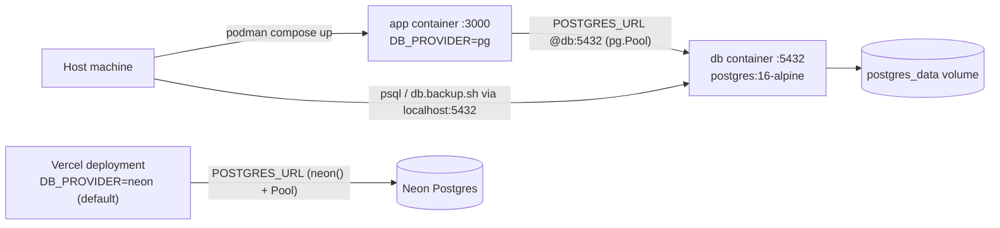

# Self-Host MemGrow with Podman Compose

## Decisions resolved via grilling session

- **Network topology**: undecided/deferred. Plan stays proxy-agnostic (no bundled TLS/reverse-proxy container); `AUTH_TRUST_HOST=true` by default; README gets a one-line note to put a reverse proxy in front if exposed publicly.
- **DB port binding**: `127.0.0.1:5432:5432` only — never bound to all interfaces.
- **Fresh-install seeding mechanism**: CLI script via `tsx` (new devDependency), not an HTTP token-gated route — keeps seeding entirely off the HTTP attack surface.
- **Docker base image**: `node:20-bookworm-slim` confirmed over alpine — prioritize native-module (`bcrypt`/`sharp`) build reliability over image size.
- **Boot persistence**: add Podman Quadlet systemd unit files, not just `restart: unless-stopped` — survives host reboots. Requires `loginctl enable-linger $USER` for rootless services without an active login session.
- **Update strategy**: `git pull` + rebuild (`podman compose build`), documented in the README; no image registry/tagging pipeline.
- **Test suite cleanup**: included in this plan now (not deferred) — low risk, removes duplicate logic while `db.ts` is already being touched.
- **Fresh-install bootstrap account**: `pnpm db:seed` defaults to `--schema-only` (batches 001-012 only, skipping the hardcoded demo user/password in `seedData()`), then interactively prompts for a real admin name/email/password to insert. Full seed (with demo data) is only available via an explicit flag for local dev use, never presented as the self-host default.

## Context / why this plan differs from the three draft plans

Three earlier draft plans were compared (Podman v1, Docker, Podman v2). This plan merges the best-verified parts of each, since Vercel/Neon stays in production in parallel with self-hosting:

- **Keep the Neon driver for Vercel** (ruled out draft plan 3's "remove `@neondatabase/serverless` entirely" — risky for serverless connection limits since Vercel stays live).
- **Use an explicit `DB_PROVIDER` env switch**, not implicit URL-sniffing (draft plan 2's approach beats draft plan 1's "detect Neon by inspecting the connection string").
- **Extend the switch to `app/seed/client.ts` too** — none of the three draft plans handled this; leaving it Neon-only would break seeding against self-hosted Postgres.
- **Fix the `/seed` auth-bootstrap bug**: verified that [proxy.ts](proxy.ts) + [auth.config.ts](auth.config.ts)'s `authorized()` callback blocks any unauthenticated request to `/seed` (only `/` is exempt). `curl http://localhost:3000/seed` on a fresh install will just redirect to `/login` and do nothing — this was wrong in two of the three draft plans. Fix: add a CLI seed script that runs the same logic in-process, bypassing HTTP/auth.
- **Fix the `.env.example` / `.gitignore` bug**: [.gitignore](.gitignore) has a blanket `.env*` rule with no exceptions, so a new `.env.example` file would never actually get committed unless we add `!.env.example`.
- **De-duplicate the test Postgres adapter**: once `db.ts` has a real explicit `pg` code path, tests can use it directly (by setting `DB_PROVIDER=pg` for tests) instead of maintaining a parallel copy in `tests/setup/pg-sql.ts`.

## 1. Driver layer: `DB_PROVIDER` switch

### [app/lib/db.ts](app/lib/db.ts)

Add `DB_PROVIDER` env var (`neon` default | `pg`). When `pg`, route both the tagged-template and `.query()` through a `pg.Pool` (same shape as [tests/setup/pg-sql.ts](tests/setup/pg-sql.ts)'s `createPgSqlAdapter`, `{rows, rowCount}`). When `neon` (default/unset), keep the current `neon()` + `Pool` behavior unchanged — zero risk to the live Vercel deployment.

### [app/seed/client.ts](app/seed/client.ts)

Same `DB_PROVIDER` branch: when `pg`, `import { Pool, PoolClient } from 'pg'` instead of `@neondatabase/serverless`. This is required for the `/seed` route (and the new CLI seed script below) to work against self-hosted Postgres at all — none of the three draft plans covered this file for the dual-mode case.

### [package.json](package.json)

Move `pg` from `devDependencies` to `dependencies` (now a runtime dependency, not just test-only). Keep `@neondatabase/serverless` as-is.

## 2. Test suite de-duplication

- [tests/setup/env.ts](tests/setup/env.ts): remove the `vi.mock('@/app/lib/db', ...)` block; instead set `process.env.DB_PROVIDER = 'pg'` alongside the existing `POSTGRES_URL` assignment. Verified `setupFiles` run before each test file's imports resolve (per [vitest.config.ts](vitest.config.ts)), so this ordering works the same way the current `POSTGRES_URL` assignment already does.
- Delete [tests/setup/pg-sql.ts](tests/setup/pg-sql.ts) — superseded now that `db.ts` itself has a real `pg` path exercised directly by tests.
- No test currently imports `app/seed/client.ts` directly (verified), so no test changes needed there.

## 3. Fresh-install seeding without auth (fixes the `/seed` bug)

- Add `tsx` as a new devDependency (no existing TS-runner in this project) to run the CLI script directly.
- Refactor [app/seed/route.ts](app/seed/route.ts) so schema creation (batches 001-012) and demo data (`seedData()`) are separately callable, e.g. export `createSchema()` and `seedDemoData()` from a shared module, called by both the existing route (unchanged, still auth-protected, still runs both for local dev convenience) and a new CLI entry point.
- Add `scripts/db.seed.ts`:
  - Default behavior: `createSchema()` only (`--schema-only`, and this is the default with no flag), then interactively prompt (via Node `readline`) for admin `name`/`email`/`password`, and insert that one user directly (bcrypt hash, same pattern as [app/lib/actions/auth.ts](app/lib/actions/auth.ts)'s `addNewUser`) with `is_admin = true`.
  - `--with-demo-data` flag: also runs `seedDemoData()` — the hardcoded demo user/courses/words from [app/lib/seed-data.ts](app/lib/seed-data.ts) — for local dev/testing only, never the self-host default.
  - Runs via Node directly (`pnpm tsx scripts/db.seed.ts`), bypassing HTTP/auth entirely — appropriate since it's only runnable from a host shell that already has `.env` access.
- Add a `db:seed` script to `package.json` for convenience.
- Document in the README that a truly fresh self-hosted install (no backup to restore) should use `pnpm db:seed`, not `curl /seed`.

## 4. Next.js + Docker build

### [next.config.ts](next.config.ts)

Add `output: 'standalone'`.

### `Dockerfile` (new)

Multi-stage, `node:20-bookworm-slim` (glibc — avoids musl edge cases with `bcrypt`/`sharp` native builds vs alpine) with `corepack`/pnpm:

- deps stage: install with pnpm
- build stage: `pnpm build`, pass `NEXT_PUBLIC_BUILD_COMMIT`/`NEXT_PUBLIC_BUILD_TIME` build args
- runtime stage: copy `.next/standalone`, `.next/static`, `public/`; run as non-root user; `CMD ["node", "server.js"]`

### `.dockerignore` (new)

Exclude `node_modules`, `.next`, `.env*`, `DB_BACKUPS`, `.git`, test artifacts.

## 5. `compose.yml` (new)

Two services:

- **`db`** — `postgres:16-alpine`, named volume `postgres_data`, `pg_isready` healthcheck, port **`127.0.0.1:5432:5432`** (localhost-only — required so [scripts/db.backup.sh](scripts/db.backup.sh) / [scripts/db.restore.sh](scripts/db.restore.sh) keep working unmodified, but never reachable from the network).
- **`app`** — built from `Dockerfile`, `depends_on: db (service_healthy)`, explicit `environment:` block (not `env_file`, to avoid leaking the host-facing `POSTGRES_URL` into the container) setting `DB_PROVIDER=pg`, `POSTGRES_URL=postgresql://...@db:5432/...`, `AUTH_SECRET`, `AUTH_URL`, `AUTH_TRUST_HOST=true`, plus pass-through optional keys (`OPENAI_API_KEY`, `ELEVENLABS_API_KEY`, etc). Port `3000:3000`, `restart: unless-stopped`.

Schema is created via `pnpm db:seed` (§3) rather than a mounted `docker-entrypoint-initdb.d` SQL file — avoids maintaining the schema in two places (seed batches + a derived SQL dump).

## 5b. Podman Quadlet units for boot persistence (new)

`compose.yml` remains the primary dev/build interface (`podman compose build`, manual `up`/`down`, logs), but for always-on operation add native Quadlet unit files so systemd supervises the containers and restarts them on boot:

- `systemd/memgrow.network` — shared Podman network unit
- `systemd/memgrow-db.container` — Postgres service, references the network unit, same volume/healthcheck/port config as `compose.yml`'s `db` service
- `systemd/memgrow-app.container` — app service, `After=memgrow-db.service`, same env as `compose.yml`'s `app` service
- Install under `~/.config/containers/systemd/` (rootless), then `systemctl --user daemon-reload && systemctl --user enable --now memgrow-app.service`
- Document `loginctl enable-linger $USER` so the rootless user services keep running after logout/reboot without an active session

## 6. `.env.example` + `.gitignore`

- Add `.env.example` documenting all vars: `POSTGRES_USER/PASSWORD/DB`, host-facing `POSTGRES_URL` (localhost, for `pnpm dev` + backup scripts), `DB_PROVIDER`, `AUTH_SECRET`, `AUTH_URL`, `AUTH_TRUST_HOST`, optional integration keys.
- [.gitignore](.gitignore): add `!.env.example` exception to the blanket `.env*` rule so the template actually gets committed.

## 7. README self-hosting section

Add a runbook covering:

- Prerequisites (`podman compose version`, optional host `postgresql` package for `pg_dump`/`pg_restore`)
- Start/stop/logs (`podman compose up -d --build`, `down`, `down -v`, `logs -f`)
- Connecting via `psql` (host and `podman compose exec db psql`)
- Backup/restore via existing scripts, plus a fallback using `podman compose exec -T db pg_dump`/`pg_restore` for hosts without local Postgres client tools
- **Migrating existing Vercel/Neon data**: run `scripts/db.backup.sh` against the Neon `POSTGRES_URL`, then `scripts/db.restore.sh` against the self-hosted one
- **Fresh install with no backup**: `pnpm db:seed` (not `curl /seed`) — creates schema and prompts for a real admin account; demo/dev data only via `--with-demo-data`
- **Running on boot**: installing the Quadlet units, `loginctl enable-linger`, checking status with `systemctl --user status memgrow-app.service`
- **Updating**: `git pull && podman compose build && systemctl --user restart memgrow-app.service` (or `podman compose up -d --build` if not using Quadlets)
- **Exposing publicly**: one-line note to put a reverse proxy with TLS in front; `AUTH_TRUST_HOST=true` is already set for this

## Verification checklist

- `pnpm tsc && pnpm eslint && pnpm test` pass (Neon path unchanged, pg path now exercised by real `db.ts` in tests)
- `podman compose up -d --build` succeeds, `db` becomes healthy, `app` starts
- `curl -I http://localhost:3000` responds
- `pnpm db:seed` (run against the container's Postgres) succeeds, prompts for and creates an admin account
- Login works with that admin account
- `./scripts/db.backup.sh` / `./scripts/db.restore.sh` round-trip cleanly against `localhost:5432`
- `db` port is not reachable from another machine on the network (only `127.0.0.1`)
- Quadlet units start the stack on a simulated reboot (`systemctl --user restart` after `loginctl enable-linger`)
- Vercel deployment (`DB_PROVIDER` unset/`neon`) still builds and runs unaffected
